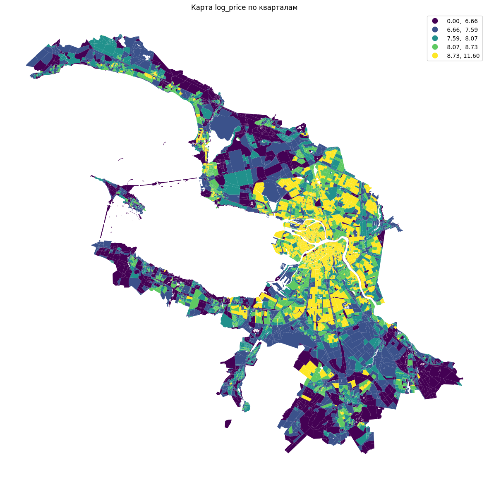
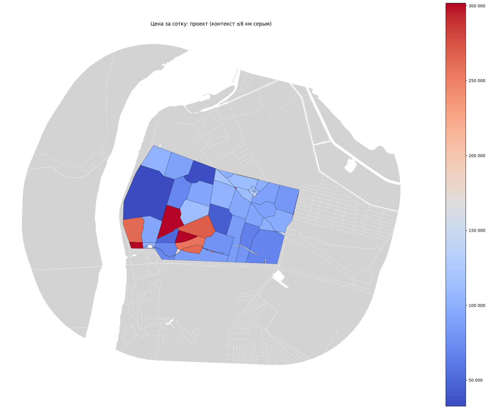
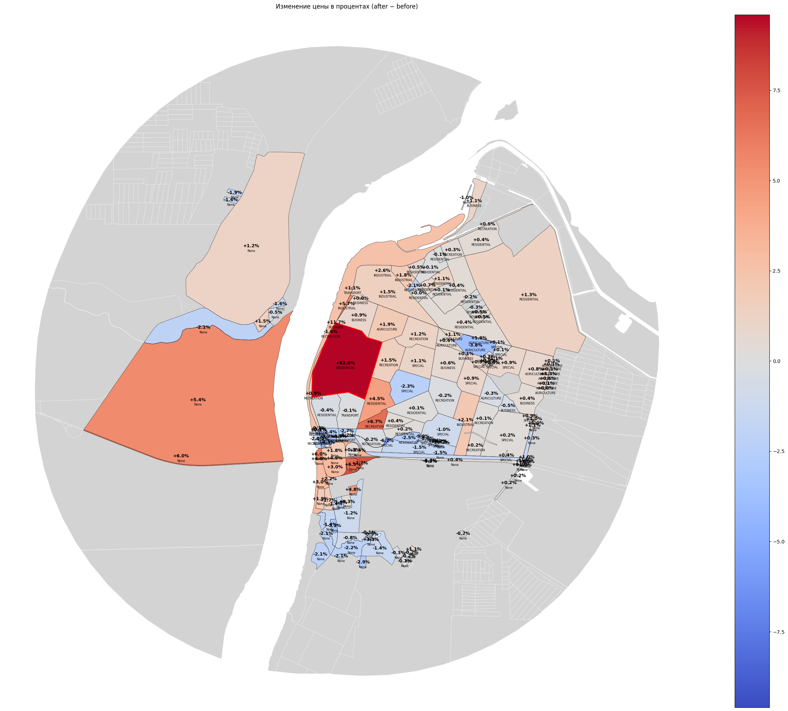
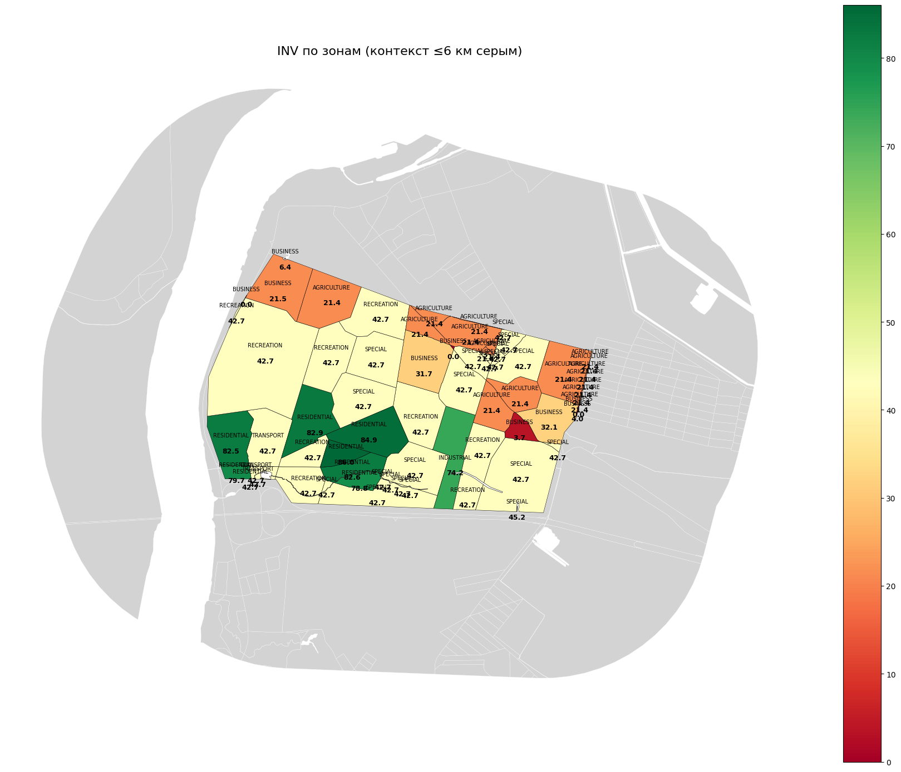

Urbanomy
=========================================================
.. logo-start

.. logo-end

|TestsStatus| |DocsStatus| |PythonVersion|

.. readme-start

Overview
--------
Urbanomy is a research toolkit from the Institute of Design and Urban Studies (IDU) for assessing land parcels from spatial, economic, and scenario perspectives. The library bundles geospatial feature engineering, CatBoost-based land-price modelling, multi-criteria investment scoring, and socio-economic ripple analysis into one reproducible codebase.

Highlights
----------
- **Land-value modelling** – build spatial lag features, estimate land prices, and visualise impacts with pre-trained CatBoost models (`urbanomy.methods.land_value_modeling <src/urbanomy/methods/land_value_modeling>`_).
- **Scenario planning** – modify individual blocks, recompute indicators, and plot price deltas for what-if cases (`urbanomy.methods.land_value_modeling.scenario_modification <src/urbanomy/methods/land_value_modeling/scenario_modification.py>`_).
- **Investment attractiveness** – aggregate cashflows, NPV/IRR/ROI metrics, and weighted spatial potential into a combined INV score (`urbanomy.methods.investment_potential <src/urbanomy/methods/investment_potential>`_).
- **Socio-economic footprint** – quantify fiscal and employment effects during construction and operation phases with `SEREstimator <src/urbanomy/methods/ser/ser_calculate.py>`_.
- **Robust data validation** – Pandera-based schemas for tabular and GeoDataFrame inputs (`urbanomy.utils <src/urbanomy/utils>`_).

Installation
------------
Urbanomy requires Python 3.10 and system libraries for GeoPandas (GEOS, GDAL, PROJ). We recommend working inside a virtual environment.

.. code-block:: bash

   git clone https://github.com/iduclub/Urbanomy.git
   cd Urbanomy
   pip install -e .

Optional dependency groups:

- ``pip install -e '.[dev]'`` – formatting, linting, pre-commit hooks.
- ``pip install -e '.[test]'`` – pytest and coverage tooling.
- ``pip install -e '.[docs]'`` – Sphinx stack for building the documentation.

Quickstart
----------
Land-value modelling
~~~~~~~~~~~~~~~~~~~~
.. code-block:: python

   import pandas as pd
   import geopandas as gpd
   from catboost import CatBoostRegressor
   from urbanomy.methods.land_value_modeling import (
       LandDataPreparator,
       LandPriceEstimator,
       plot_land_price_maps,
   )

   scenario = gpd.read_file("data/scenario_blocks.geojson")
   context = gpd.read_file("data/context_blocks.geojson")
   accessibility = pd.read_pickle("data/accessibility.pkl")

   preparator = LandDataPreparator(
       scenario_blocks_source=scenario,
       context_blocks_source=context,
       accessibility_matrix_source=accessibility,
   )
   prepared_blocks = preparator.prepare()

   model = CatBoostRegressor()
   model.load_model("models/land_price.cbm")

   estimator = LandPriceEstimator(model=model, blocks=prepared_blocks)
   price_map = estimator.predict()
   plot_land_price_maps(blocks_pred=price_map, scenario_blocks=scenario)

   Training the land-price model and generating spatial lag features

   Price change map after applying the scenario

   Comparing investments and prices for scenario and context blocks

Investment attractiveness
~~~~~~~~~~~~~~~~~~~~~~~~~
.. code-block:: python

   from urbanomy.methods.investment_potential import (
       InvestmentAttractivenessAnalyzer,
       LandUseScoreAnalyzer,
       prepare_investment_input,
   )

   # 1. Spatial potential scores per land-use
   land_use_scores = LandUseScoreAnalyzer().compute_scores_long(prepared_blocks)

   # 2. Merge scenario blocks with baseline scores
   investment_ready = prepare_investment_input(
       prepared_blocks,
       base_gdf=land_use_scores,
       scenario_flag_column="is_scn",
   )

   # 3. Calculate economic metrics and final INV index
   BENCHMARKS = {
       "residential": {"density": 1.2, "capex": 85_000, "rent_share": 0.75},
       "business": {"density": 3.0, "capex": 120_000, "rent_share": 0.65},
       # ... add other land-use profiles
   }
   analyzer = InvestmentAttractivenessAnalyzer(benchmarks=BENCHMARKS)
   enriched_blocks, project_summary = analyzer.calculate_investment_metrics(investment_ready)

   Investment metrics dashboard with the final INV index

Socio-economic effects
~~~~~~~~~~~~~~~~~~~~~~
.. code-block:: python

   import pandas as gpd
   from urbanomy.methods.ser import SEREstimator

   ser = SEREstimator(
       {
           "population": 52_000,
           "employment_base": 21_000,
           "avg_wage_base": 70_000,
       }
   )

   project_blocks = gpd.read_file('./data/test/blocks_investment.geojson')
   ser_table = ser.compute(project_blocks)
   print(ser_table)

Datasets and notebooks
----------------------
Reproducible pipelines live in ``examples/``:

- `examples/land_value_modeling/1_pricing_model_training.ipynb <examples/land_value_modeling/1_pricing_model_training.ipynb>`_ – model training workflow.
- `examples/land_value_modeling/2_land_data_preparation.ipynb <examples/land_value_modeling/2_land_data_preparation.ipynb>`_ – block feature engineering.
- `examples/land_value_modeling/3_land_price_modeling.ipynb <examples/land_value_modeling/3_land_price_modeling.ipynb>`_ – scenario pricing walkthrough.
- `examples/investment_metrics.ipynb <examples/investment_metrics.ipynb>`_ – investment attractiveness dashboard.
- `examples/socio_economic_indicators.ipynb <examples/socio_economic_indicators.ipynb>`_ – socio-economic reporting.

All notebooks rely on sample assets committed to ``examples/data`` (GeoJSON blocks, accessibility matrices, CatBoost weights, and prepared pickle files). When running the notebooks from another working directory, point the loaders to that folder or provide equivalent datasets in the same structure.

Documentation
-------------
The latest documentation is published automatically from ``main``:

https://iduclub.github.io/Urbanomy/

Build the docs locally with:

.. code-block:: bash

   pip install -e '.[docs]'
   sphinx-build docs/source docs/build

Development
-----------
We use the supplied Makefile shortcuts:

.. code-block:: bash

   make install-dev   # install editable package with dev tools
   make lint          # pylint on src/urbanomy
   make test          # pytest tests/
   make install-docs  # editable install with docs extras

Before opening a pull request:

1. Format imports with ``isort`` and code with ``black`` (``make format``).
2. Ensure ``make test`` passes.
3. Run ``sphinx-build`` if documentation is affected.

License
-------
Urbanomy is released under the BSD-3-Clause license. See ``LICENSE`` for the full text.

Contact
-------
Maintainer: Maksim Natykin (``mvin@itmo.ru``)  
Issues & feature requests: https://github.com/iduclub/Urbanomy/issues

.. |TestsStatus| image:: https://github.com/iduclub/Urbanomy/actions/workflows/tests.yml/badge.svg
   :target: https://github.com/iduclub/Urbanomy/actions/workflows/tests.yml
   :alt: Tests status

.. |DocsStatus| image:: https://github.com/iduclub/Urbanomy/actions/workflows/documentation.yml/badge.svg
   :target: https://github.com/iduclub/Urbanomy/actions/workflows/documentation.yml
   :alt: Documentation build status

.. |PythonVersion| image:: https://img.shields.io/badge/python-3.10-blue.svg
   :target: https://www.python.org/downloads/release/python-3100/
   :alt: Supported Python version
